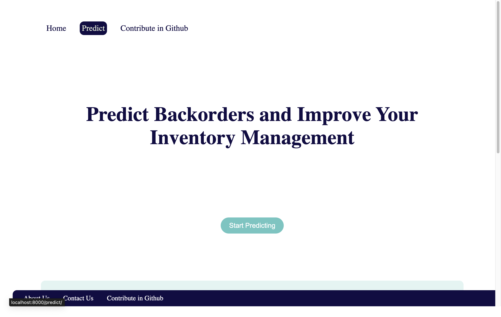
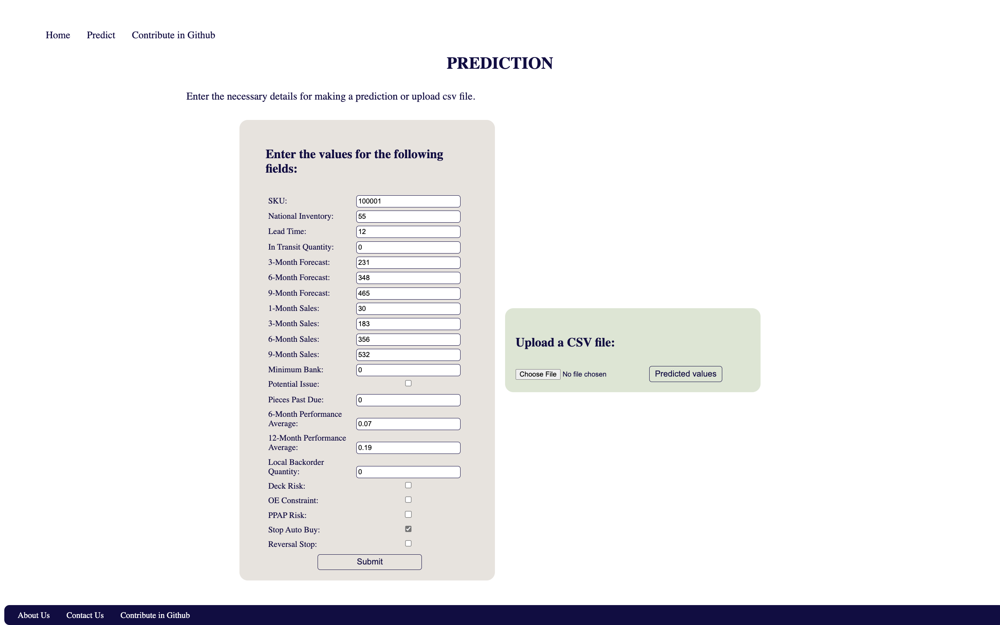
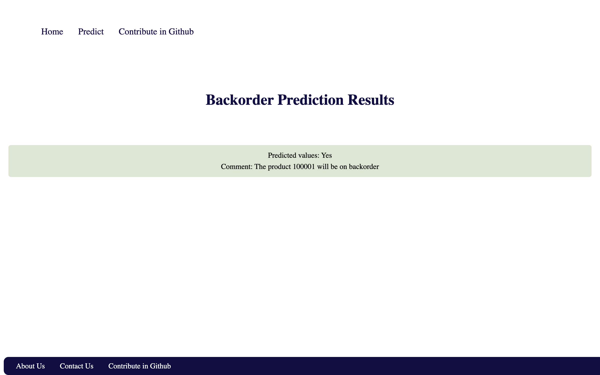
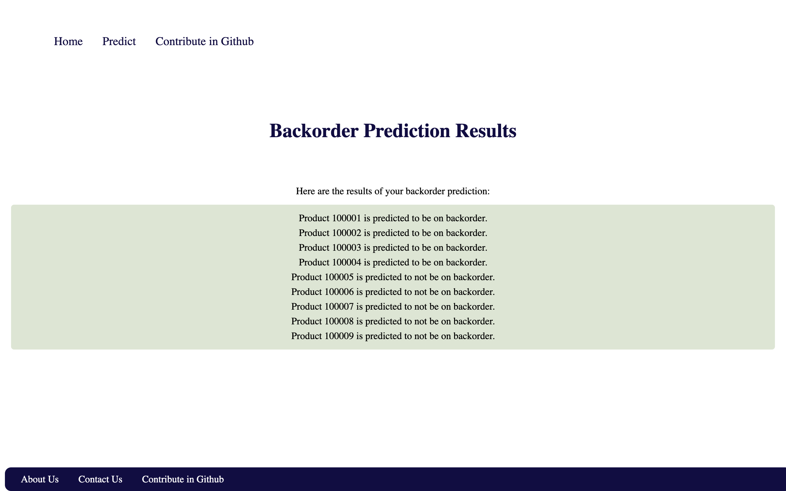

# Title: Advanced Machine Learning-Driven Backorder Prediction System

Experience a state-of-the-art Django web application designed to predict product backorders with exceptional accuracy. This platform leverages advanced machine learning techniques, incorporating pre-trained Random Forest Classifier, Decision Tree, and LGBM models. By analyzing critical features such as product availability and lead time, it ensures precise and reliable backorder predictions, showcasing cutting-edge expertise in data science and machine learning.

## Table of Contents

- [Installation and Usage](#installation-and-usage)
- [Features](#features)
- [Development](#development)
- [License](#license)
- [Credits](#credits)

## Installation and Usage

### Cloning the Project

To clone this project, run the following command in your terminal:

```bash
git clone https://github.com/Pradyothsp/backorder-prediction.git
```

### Creating Virtual Environment

```bash
python3 -m venv venv
source venv/bin/activate
```

### Getting Started

Navigate to the project directory and follow the steps below to set up and run the project locally:

```bash
cd app
```

1. Install the required dependencies by running the following command:

    ```bash
    pip install -r requirement.txt
    ```

2. Run the Django migrations to set up the database:

    ```bash
    python3 manage.py makemigrations
    python3 manage.py migrate
    ```

3. Start the Django development server:

    ```bash
    python3 manage.py runserver
    ```

4. Open your web browser and navigate to **`http://localhost:8000/`** to view the application.

    The application has a simple web interface where you can input the product features and get a prediction on whether the product will go on backorder or not.

    You can also make predictions using the API endpoint by sending a POST request to **`http://localhost:8000/predict/`** with a JSON payload containing the product features.

## Libraries Used
- **scikit-learn**
- **numpy**
- **pandas**
- **Flask**
- **joblib**
- **requests**
- **MatplotLib**
- **Django**

## Features

- **Backorder Prediction:** Predict whether a product will go on backorder or not based on various features.
- **Batch Prediction:** Provide a CSV file containing multiple product records for batch prediction of backorder status.
- **Single Product Prediction:** Offer a form interface to input the features of a single product and obtain a prediction on its backorder status.

## Result

The table below shows the performance metrics of different models on the backorder prediction task. The models evaluated are Decision Tree, Random Forest, and Light GBM. The dataset used for evaluation consists of train, validation, and test sets.

| Model | Data Set | Accuracy | Recall | Precision |
| --- | --- | --- | --- | --- |
| Decision Tree | Train | 0.946 | 0.9651 | 0.9814 |
|  | Valid | 0.8818 | 0.9079 | 0.8445 |
|  | Test | 0.8633 | 0.8065 | 0.0605 |
| Random Forest | Train | 0.9981 | 0.9982 | 0.9998 |
|  | Valid | 0.9194 | 0.9513 | 0.9727 |
|  | Test | 0.9003 | 0.8077 | 0.1878 |
| Light GBM | Train | 0.9941 | 0.9954 | 0.9997 |
|  | Valid | 0.9221 | 0.9513 | 0.9675 |
|  | Test | 0.9069 | 0.7939 | 0.2052 |

### Screenshots

**Home Page**:



**Predict:**



**Result (Single Product Prediction):**



**Result (Batch Prediction):**



## Development

This application was developed using **Django 4**. The backorder prediction model was trained using scikit-learn and is stored in the **`backorder/model/backorder_best_model.pkl`** file.

To train a new prediction model, you can run the **`model.ipynb`** Jupyter Notebook in the root directory.


## Credits

This project was created by [Rayyan Ahmed]( https://www.linkedin.com/in/rayyan-ahmed9477/ ).
